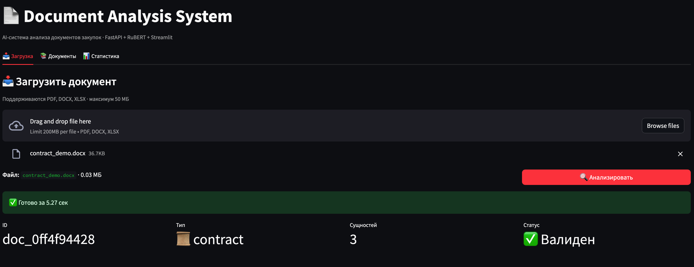
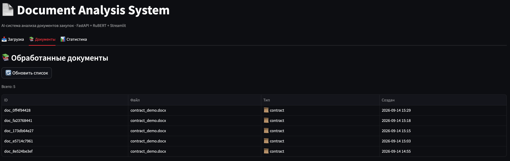
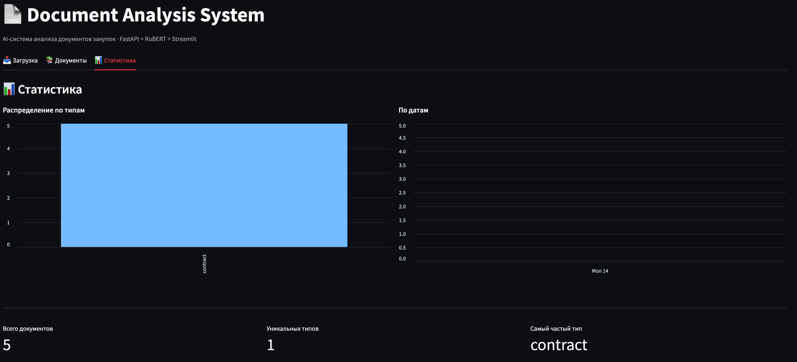

# 📄 Document Analysis System

AI-система для автоматического анализа документов закупок: извлечение сущностей,
классификация типов документов и валидация по бизнес-правилам.


## ✨ Возможности

- 📥 Загрузка документов форматов **PDF / DOCX / XLSX**
- 🔍 **Гибридное извлечение сущностей**: ML (RuBERT/multilingual NER) + regex для дат и сумм
- 🏷 Классификация типа документа (договор / счёт / акт)
- ✅ Валидация по бизнес-правилам (обязательные поля, confidence)
- 💾 Хранение результатов в SQLite
- 📊 REST API с автодокументацией (Swagger UI)
- 🎨 Web-дашборд на Streamlit
- 🧪 23 теста, покрытие 85%
- ⚙️ CI на GitHub Actions

## 🏗 Архитектура

```
┌──────────┐   ┌─────────┐   ┌─────────────┐   ┌──────────┐   ┌────────┐
│  Upload  │ → │ Parser  │ → │  NER + Regex│ → │ Validator│ → │   DB   │
│ (FastAPI)│   │ PDF/DOCX│   │  (Hybrid)   │   │  Rules   │   │SQLite  │
└──────────┘   └─────────┘   └─────────────┘   └──────────┘   └────────┘
                                    ↑
                            ┌───────────────┐
                            │ Streamlit UI  │
                            │  (dashboard)  │
                            └───────────────┘
```

## 🎨 Дашборд

Веб-интерфейс на Streamlit для работы с системой без curl.

### 🖼 Скриншоты

**Загрузка и анализ документа**



**Список обработанных документов**



**Статистика**



## 🚀 Быстрый старт

### Требования

- Python 3.11+
- ~2 ГБ свободного места (для ML-модели)

### Установка

```bash
git clone https://github.com/vbat-data/document-analysis-system.git
cd document-analysis-system

python3.11 -m venv venv
source venv/bin/activate        # macOS/Linux
# venv\Scripts\activate         # Windows

pip install -r requirements.txt
```

### Запуск API

```bash
uvicorn src.main:app --reload
```

Swagger UI: **http://127.0.0.1:8000/docs**

### Запуск дашборда (в отдельном терминале)

```bash
source venv/bin/activate
streamlit run dashboard/app.py
```

Дашборд: **http://localhost:8501**

> ⏱ **Первый анализ может занять до минуты** — ML-модель скачивается (~700 МБ) и загружается в память. Последующие запросы — 1–3 секунды.

## 📡 Примеры API

```bash
# Проверка статуса
curl http://127.0.0.1:8000/health

# Загрузка документа
curl -X POST http://127.0.0.1:8000/documents/upload \
  -F "file=@data/samples/contract_demo.docx"

# Список обработанных документов
curl http://127.0.0.1:8000/documents

# Получить документ по ID
curl http://127.0.0.1:8000/documents/doc_abc123
```

## 🧪 Тесты

```bash
pytest
```

23 теста · покрытие ~85% · прогон за 0.3 сек.

### Как устроены тесты

- **API** (`test_api.py`) — эндпоинты с тестовой БД в `tmp_path`, ML-модель замокана
- **Processor** (`test_processor.py`) — парсинг, классификация, regex-извлечение
- **Validators** (`test_validators.py`) — бизнес-правила

ML-модель в тестах **не загружается** — используем fake-модель. Это делает тесты быстрыми и стабильными в CI.

## 🛠 Стек

| Слой | Технологии |
|------|-----------|
| API | FastAPI, Uvicorn |
| Валидация | Pydantic v2 |
| БД | SQLAlchemy 2.0, SQLite |
| ML / NLP | HuggingFace Transformers, Davlan multilingual BERT NER |
| Regex | Даты, суммы (гибридный подход) |
| Парсинг | pdfplumber, python-docx, pandas |
| UI | Streamlit |
| Тесты | pytest, pytest-cov, httpx |
| CI | GitHub Actions |

## 💡 Гибридный подход к извлечению

**Почему не только ML?**

Стандартные NER-модели (включая RuBERT) **не выделяют DATE и MONEY** — это отдельные задачи. В production используется гибрид:

| Тип сущности | Метод | Почему |
|--------------|-------|--------|
| **ORG** (организации) | ML NER | Требует понимания контекста |
| **DATE** (даты) | Regex | 100% точность на форматах `01.01.2024` |
| **MONEY** (суммы) | Regex | 100% точность на `150 000 руб` |

**Результат:** ML отвечает за recall (понимание), regex — за precision (точность на шаблонах).

## 📁 Структура проекта

```
document-analysis-system/
├── .github/workflows/tests.yml    # CI pipeline
├── dashboard/
│   └── app.py                     # Streamlit UI
├── docs/screenshots/              # скриншоты для README
├── src/
│   ├── main.py                    # FastAPI entry point
│   ├── config.py                  # Settings (pydantic-settings)
│   ├── schemas.py                 # Pydantic models
│   ├── database.py                # SQLAlchemy models
│   ├── ml_models.py               # NER wrapper (lazy-loaded)
│   ├── document_processor.py      # Parsing + hybrid extraction
│   ├── validators.py              # Business rules
│   └── api/routes.py              # HTTP endpoints
├── tests/                         # pytest suites
├── data/samples/                  # примеры документов
├── requirements.txt
├── pyproject.toml
└── README.md
```

## 🗺 Roadmap

- [x] MVP: FastAPI + NER + regex + валидация + тесты + CI
- [x] Streamlit-дашборд
- [ ] Docker-контейнеризация
- [ ] Fine-tuning NER на доменных данных
- [ ] OCR для сканированных PDF
- [ ] Экспорт результатов в Excel
- [ ] Интеграция с 1С:Документооборот

## 📝 Лицензия

MIT